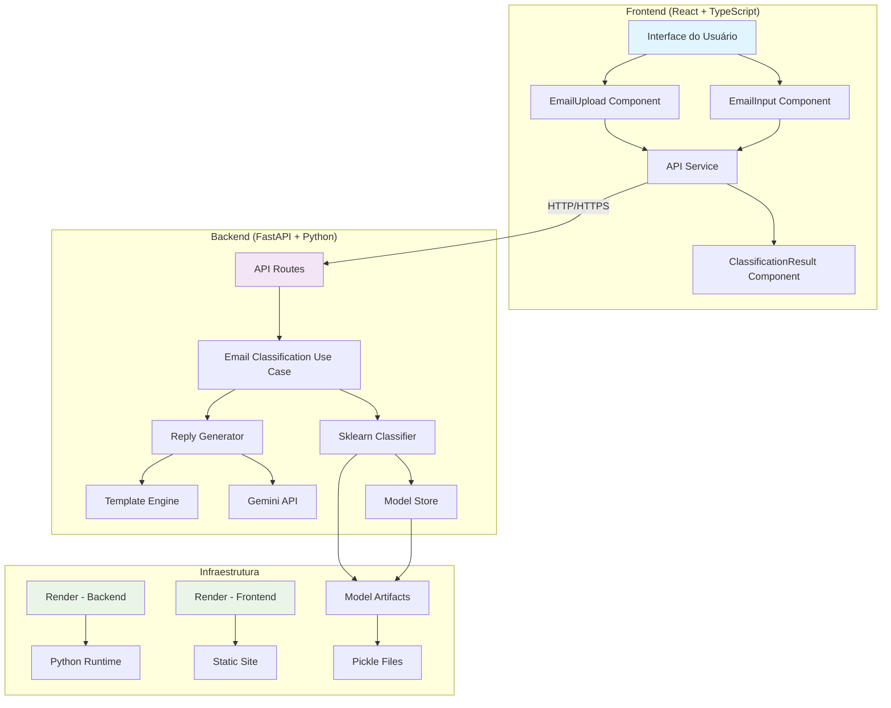

# AutoU - Classificador de Emails com IA

Sistema inteligente de classificação automática de emails que utiliza Machine Learning e APIs de IA para categorizar emails como produtivos ou improdutivos, além de gerar respostas sugeridas automaticamente.

## 🚀 Funcionalidades

- **Classificação Automática**: Identifica se um email é produtivo ou improdutivo
- **Respostas Inteligentes**: Gera sugestões de resposta usando IA (Gemini)
- **Upload de Arquivos**: Suporte para arquivos .txt e .pdf
- **Interface Moderna**: Interface React responsiva e intuitiva
- **API RESTful**: Backend FastAPI com documentação automática
- **Deploy Automático**: Configuração para Render com deploy contínuo

## 🏗️ Arquitetura do Sistema



## 📁 Estrutura do Projeto

```
AutoU/
├── backend/                    # API FastAPI
│   ├── src/
│   │   ├── adapters/          # Adaptadores externos
│   │   │   ├── nlp/           # Processamento de linguagem
│   │   │   ├── parsers/       # Parsers de arquivos
│   │   │   ├── persistence/   # Armazenamento de modelos
│   │   │   └── reply/         # Geradores de resposta
│   │   ├── config/            # Configurações
│   │   ├── core/              # Entidades e protocolos
│   │   ├── interfaces/        # API e rotas
│   │   └── use_cases/         # Casos de uso
│   ├── model_artifacts/       # Modelos treinados
│   ├── main.py               # Ponto de entrada
│   └── requirements.txt      # Dependências Python
├── frontend/                  # Interface React
│   ├── src/
│   │   ├── components/       # Componentes React
│   │   ├── pages/           # Páginas da aplicação
│   │   ├── services/        # Serviços de API
│   │   └── hooks/           # Hooks customizados
│   ├── package.json         # Dependências Node.js
│   └── vite.config.ts       # Configuração Vite
├── render.yaml              # Configuração Render
└── DEPLOY.md               # Instruções de deploy
```

## 🛠️ Tecnologias Utilizadas

### Backend

- **FastAPI**: Framework web moderno e rápido
- **Scikit-learn**: Machine Learning para classificação
- **Google Gemini**: API de IA para geração de respostas
- **Pydantic**: Validação de dados
- **Uvicorn**: Servidor ASGI

### Frontend

- **React 18**: Biblioteca para interfaces
- **TypeScript**: Tipagem estática
- **Vite**: Build tool moderno
- **Tailwind CSS**: Framework CSS utilitário
- **Shadcn/ui**: Componentes de interface
- **Lucide React**: Ícones

### Infraestrutura

- **Render**: Plataforma de deploy
- **GitHub**: Controle de versão
- **Python 3.11+**: Runtime backend
- **Node.js 18+**: Runtime frontend

## 🚀 Como Executar Localmente

### Pré-requisitos

- Python 3.11+
- Node.js 18+
- npm ou yarn

### Backend

1. **Clone o repositório:**

```bash
git clone <repository-url>
cd AutoU/backend
```

2. **Crie um ambiente virtual:**

```bash
python -m venv venv
source venv/bin/activate  # Linux/Mac
# ou
venv\Scripts\activate     # Windows
```

3. **Instale as dependências:**

```bash
pip install -r requirements.txt
```

4. **Execute o servidor:**

```bash
python main.py
```

O backend estará disponível em: http://localhost:8000

### Frontend

1. **Navegue para o diretório frontend:**

```bash
cd ../frontend
```

2. **Instale as dependências:**

```bash
npm install
```

3. **Execute o servidor de desenvolvimento:**

```bash
npm run dev
```

O frontend estará disponível em: http://localhost:8080

## 📡 API Endpoints

### Classificação de Email

```http
POST /api/process_email
Content-Type: multipart/form-data

# Parâmetros:
- text: string (opcional) - Texto do email
- file: file (opcional) - Arquivo .txt ou .pdf
```

**Resposta:**

```json
{
  "category": "Produtivo",
  "confidence": 0.85,
  "suggested_reply": "Resposta gerada pela IA...",
  "classify_source": "SklearnEmailClassifier",
  "reply_source": "GeminiReplyGenerator"
}
```

### Health Check

```http
GET /health
```

**Resposta:**

```json
{
  "status": "ok"
}
```

## 🎯 Como Usar

1. **Acesse a aplicação:** https://desafio-autou-up1n.onrender.com

2. **Escolha o método de entrada:**

   - **Upload de Arquivo**: Arraste e solte ou clique para selecionar arquivos .txt ou .pdf
   - **Inserção Manual**: Digite ou cole o conteúdo do email

3. **Processe o email:**

   - Clique em "Classificar Email"
   - Aguarde o processamento (indicador de loading)

4. **Visualize os resultados:**
   - **Categoria**: Produtivo ou Improdutivo
   - **Confiança**: Percentual de certeza da classificação
   - **Resposta Sugerida**: Texto gerado pela IA
   - **Fonte**: Classificador e gerador utilizados

## 🔧 Configuração

### Variáveis de Ambiente

**Backend:**

```env
ENV=prod
AI_PROVIDER=template  # ou gemini
GEMINI_API_KEY=sua_chave_aqui  # opcional
```

**Frontend:**

```env
VITE_API_URL=https://desafio-autou-back-fxvg.onrender.com
```

### Classificação de Emails

O sistema classifica emails baseado em:

**Emails Produtivos:**

- Solicitações de suporte
- Problemas técnicos
- Pedidos de informação
- Status de projetos
- Relatórios e documentação

**Emails Improdutivos:**

- Mensagens sociais
- Cumprimentos e felicitações
- Conteúdo ofensivo
- Conversas informais

## 🚀 Deploy

### Render (Automático)

O projeto está configurado para deploy automático no Render:

1. **Conecte o repositório** no dashboard do Render
2. **Configure as variáveis de ambiente**
3. **Deploy automático** a cada commit na branch `main`

**URLs de Produção:**

- Frontend: https://desafio-autou-up1n.onrender.com
- Backend: https://desafio-autou-back-fxvg.onrender.com
- API Docs: https://desafio-autou-back-fxvg.onrender.com/docs

## 📊 Monitoramento

- **Health Checks**: Verificação automática de saúde
- **Logs**: Disponíveis no dashboard do Render
- **Métricas**: Performance e uso de recursos
- **Alertas**: Notificações de downtime

## 🤝 Contribuição

1. Fork o projeto
2. Crie uma branch para sua feature (`git checkout -b feature/AmazingFeature`)
3. Commit suas mudanças (`git commit -m 'Add some AmazingFeature'`)
4. Push para a branch (`git push origin feature/AmazingFeature`)
5. Abra um Pull Request

## 📝 Licença

Este projeto está sob a licença MIT. Veja o arquivo `LICENSE` para mais detalhes.

## 📞 Suporte

Para suporte ou dúvidas:

- Abra uma issue no GitHub
- Consulte a documentação da API: https://desafio-autou-back-fxvg.onrender.com/docs

---

**AutoU** - Classificação inteligente de emails com IA 🚀
